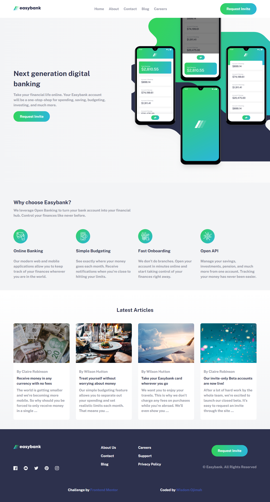

# Frontend Mentor - Easybank landing page solution

This is a solution to the [Easybank landing page challenge on Frontend Mentor](https://www.frontendmentor.io/challenges/easybank-landing-page-WaUhkoDN). Frontend Mentor challenges help you improve your coding skills by building realistic projects. 

## Table of contents

- [Overview](#overview)
  - [The challenge](#the-challenge)
  - [Screenshot](#screenshot)
  - [Links](#links)
- [My process](#my-process)
  - [Built with](#built-with)
  - [What I learned](#what-i-learned)
  - [Continued development](#continued-development)
- [Author](#author)

**Note: Delete this note and update the table of contents based on what sections you keep.**

## Overview

### The challenge

Users should be able to:

- View the optimal layout for the site depending on their device's screen size
- See hover states for all interactive elements on the page

### Screenshot



### Links

- Solution URL: [Code](https://github.com/detachedsoul/easybank-landing-page)
- Live Site URL: [Live Site](https://detachedsoul.github.io/easybank-landing-page)

- Semantic HTML5 markup
- CSS custom properties
- Flexbox
- CSS Grid
- Mobile-first workflow

### What I learned

How to change colors of svg's

```css
svg {
  fill: your color;
}
```

### Continued development

Background image alignments

## Author

- Facebook - [Wisdom Ojimah](https://web.facebook.com/IamWisdomOjimah)
- Frontend Mentor - [detachedsoul](https://www.frontendmentor.io/profile/detachedsoul)